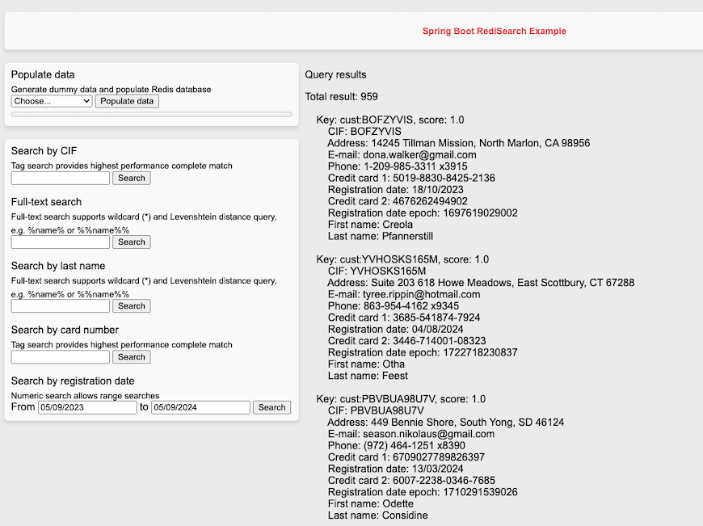

# Spring-Boot-RediSearch-Example

Sample SpringBoot code with low-level access to Jedis library, executing RediSearch commands. The sample code also incorporates Spring Data Redis, being configurable to connect to a separate Redis database.



## How to run the example

1 - Run local Redis Stack server, Redis docker image, or create a Redis Cloud database with Search module enabled:

```
docker run -d --name redis-stack-server -p 6379:6379 redis/redis-stack-server:latest
```

2 - Build and run the app:

```
mvn spring-boot:run
```

3 - Open web browser and point it to:

```
http://localhost:8080
```

4 - Click "Populate Data" to generate and populate some random customer data

5 - Search with * on full text search to get some customer details

6 - Experiment with other search fields and the code